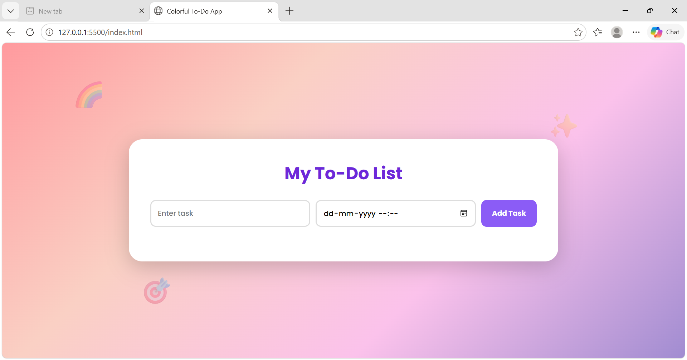
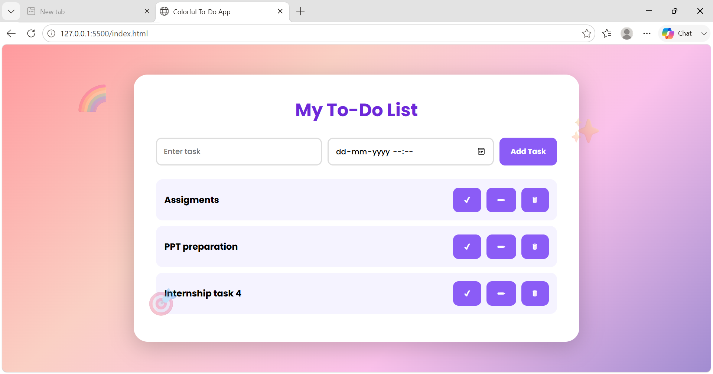
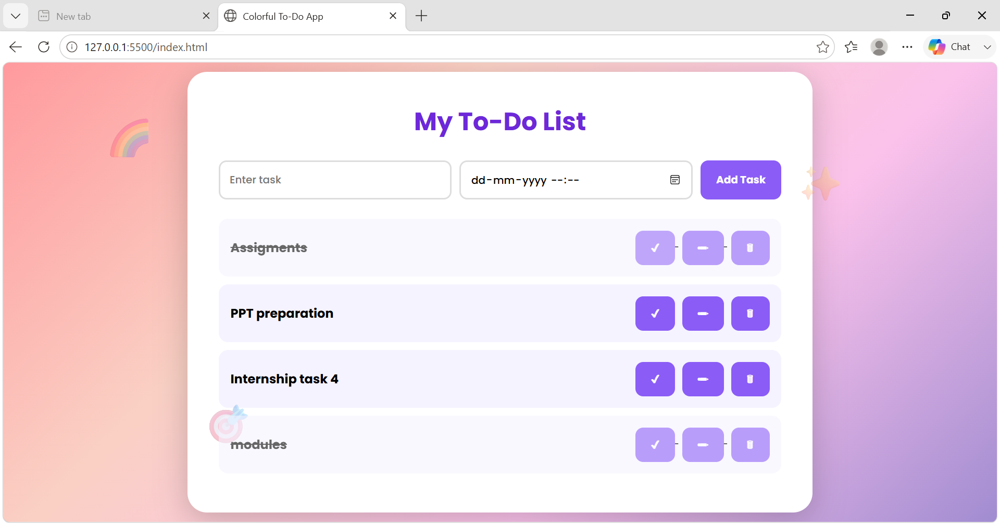

# SCT_WD_4 - To Do Web Application

## 📌 Project Overview

This project is a colorful and interactive To-Do Web Application developed as part of the SkillCraft Technology Web Development Internship.

The application enables users to manage tasks efficiently by adding, editing, deleting, scheduling, and marking tasks as completed.

---

## 🚀 Features

- Add New Tasks
- Edit Existing Tasks
- Delete Tasks
- Mark Tasks as Completed
- Set Date & Time
- Responsive Design
- Modern Colorful UI
- Doodle Inspired Interface

---

## 🛠 Technologies Used

- HTML5
- CSS3
- JavaScript

---

## 📂 Project Structure

SCT_WD_4/
│
├── index.html
├── style.css
├── script.js
├── README.md
└── screenshots/
    ├── home.png
    ├── tasks.png
    └── completed.png

---

## 📸 Screenshots

### Home Screen

### Tasks Added

### Completed Tasks

---

## ▶ How to Run

1. Download or Clone Repository
2. Open Project Folder in VS Code
3. Run index.html using Live Server
4. Manage Your Tasks

---

## 🎯 Learning Outcomes

- DOM Manipulation
- CRUD Operations
- Event Handling
- UI/UX Design
- JavaScript Fundamentals

---

## 👩‍💻 Author

Sindhu Ramagiri

GitHub:
https://github.com/sindhuramagiri-16